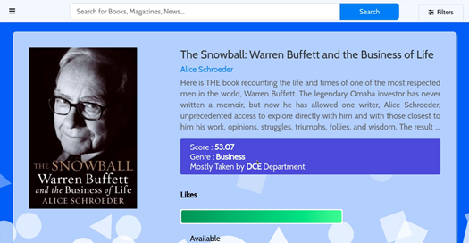
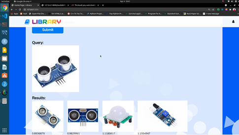

# Virtual Library Assistant
My Diploma Final Year Project

## Screenshots

### Login Page

Every system needs login system to validate the user, whether they have the right to access the system functionalities. So, our system also has login system. In our system, the login system validates the user’s credentials such as roll number and password. It helps the system to identify the registered users. Users no need to register in the virtual library assistant. It takes the user details such as roll number and password from the organization’s database. The user’s data is used to track the user history and their recommendations. If the users don’t want the system to track their history, then they can login as guest. If the user login as guest, then virtual library assistant won’t track user’s history.
  

### Home Page

The home page displays the random books from the database. It has the side menu, where you can choose the service, you want to use like image search based on keyword, image search by uploading similar image, book search, etc. At the top of the home page there is a search bar, where users can enter their query to find the books.
  

### Search Page

Search feature is the most important feature of the Virtual Library Assistant. It has an input field and the button named search at the top of the page, where users can enter their query and click the button to find the books. It also has auto suggestion system. Auto suggestion system helps in complete the query as fast as possible. The auto suggestion system gets the text in the text field, whenever user enters and returns the most relevant results from the database. It uses AJAX to send and receive data without reloading the entire page. After entering the text, click on the search button will return the most relevant results to the users.
  

### Spell Checker

Spell Checking feature is necessary in all the search system. It is very helpful in identifying the misspelled words and suggest the corrected words. Sometimes users might be misspelled the words which will lead to the retrieval of irrelevant results for that query. So, in this case, spell checking system will be useful to the system.
  

### Details Page

Whenever the user clicks any book in the results page, it will get the unique ID of the book and redirect to the details page. In details page, it receives the unique ID of the book and finds if any matching ID available in the datasets. If anything matches, then it will get all the data of the matching row and displays to the users in the results page. It shows the details of the selected book such as name, description, author name, genre, image and score.
  

### Recommendation System

The Recommendation system is developed using word2vec model. Word2vec is a group of related models that are used to produce word embeddings. These models are shallow, two-layer neural networks that are trained to reconstruct linguistic contexts of words. Word2vec is the pre-trained vectors trained on part of Google News dataset (about 100 billion words). The model contains 300-dimensional vectors for 3 million words and phrases. 
Our system finds the top 5 recommendations for the particular book and displays it to the user. The recommendations are based on the title and description of the book.
  

### Sentiment Analysis

Sentiment analysis (or opinion mining) is a natural language processing technique used to interpret and classify emotions in subjective data. Sentiment analysis is often performed on textual data to detect sentiment in emails, survey responses, social media data, and beyond. 
In our project, we’ve used sentiment analysis to detect the sentiment in comments given by the users to the books. For sentiment analysis, we’ve trained the model using the IMDb movie review dataset. It contains nearly 50,000 train data on positive and negative comments.
  

### Image Search - Text Based

Library Assistant. Image search refers to searching of images. First, it extracts each and every image from the book. Then, it will store the images in the system with the unique name. It will allocate the keywords for the image using ResNet50 ImageNet Model and stores it in the database. The Image search based on text system helps users to search images based on keywords. This will display the top 10 relevant images for that keyword.
  

### Image Search - Image Based

The image search model has been trained by using VGG16 ImageNet Model. VGG16 is a convolutional neural network model. The model achieves 92.7% top-5 test accuracy in ImageNet, which is a dataset of over 14 million images belonging to 1000 classes. The user needs to select and upload an image. Then, it will retrieve and display the top ten relevant images. The images which have lower similarity scores will get top spot and vice versa.
  

### Content Search Bot

The Content Search Bot helps the users to search the answers inside the book. It uses cdQA (Closed Domain Question Answering) module to generate answers for the questions from the paragraph. It summarizes the large content into small, so that it can perform the search even faster.
  

### User's Clicks History

The users can view their clicks history in the click’s history page. It shows the book ID and date, when the users clicked that book and the view button to view the details of the particular book. The click’s history will help the users to get the books again, which they have taken before. 
  

### Admin Console

It is only visible to the administrator. The administrator can view the Keywords analysis, Impressions and clicks report in the admin console. It generates four types of plots for easy analysis using matplotlib library.
  

### Add/Update Books

If the administrator wants to update the details of the book, then the admin should enter the book id and click on the update button in the admin home page to get to the book update page. The book update page will get the book id and retrieves all the data of the books such as title of the book, description of the book, genre of the book, link to the cover image of the book, rating of the book, number of ratings, author name of the book, author rating, published year, edition of the book. The administrator can change any of the fields he wants and after complete editing, he should click the save button to save the records he edited.
  

### Plots

Plots are very necessary for each business to identify the performance of the system over the period of time. Basically, humans are fond of visual diagrams than text or numbers. Python offers numerous math libraries to analyze the data and plot the graphs. Out of which, matplotlib helps us to do plotting of data into various forms like line plot, bar plot, scatter plot, pie chart, etc. In our project, we have mainly focused on four plots called line, bar, scatter and pie. Different plots help the person to visualize and analyze the data even better.
  